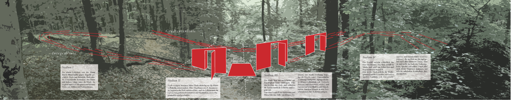
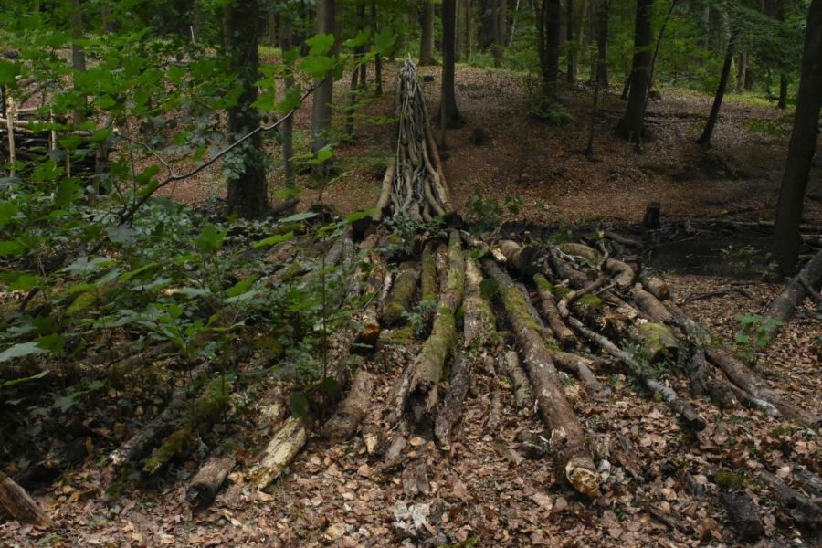
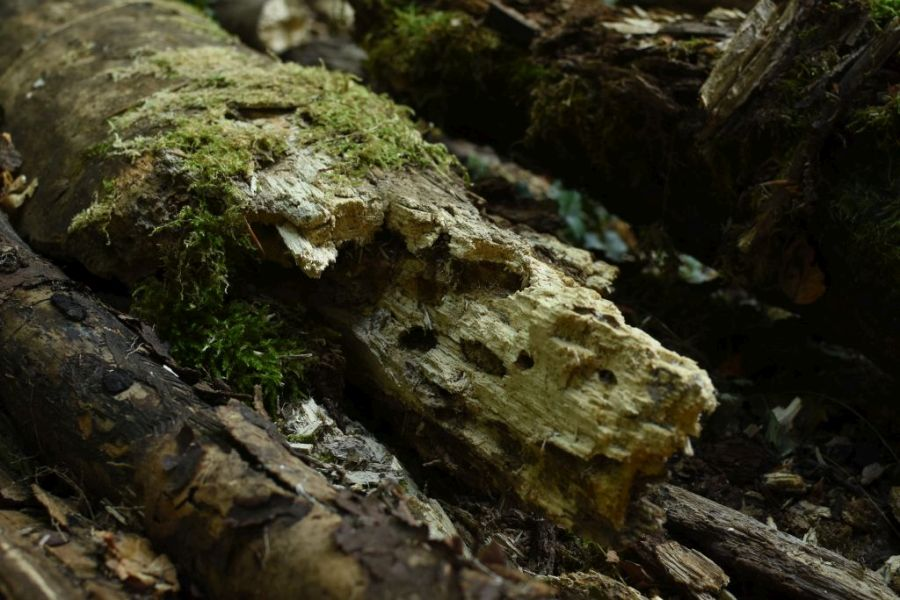
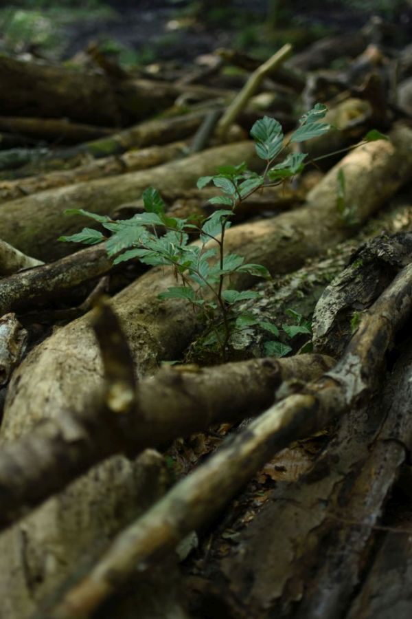
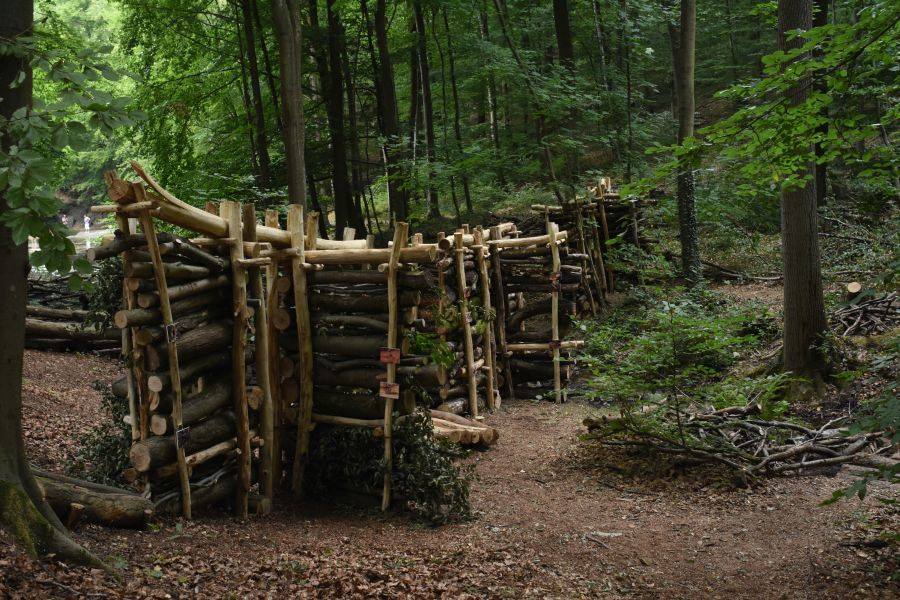

<div class = "figure fullwidth">
<div style="padding:56.25% 0 0 0;position:relative;"><iframe src="https://player.vimeo.com/video/290871214?autoplay=1&loop=1&title=0&byline=0&portrait=0" style="position:absolute;top:0;left:0;width:100%;height:100%;" frameborder="0" webkitallowfullscreen mozallowfullscreen allowfullscreen></iframe></div>
</div>

```{marginfigure}
Joachim Jacob, geb. 1959, studierte Biologie, Philosophie und Architektur. Fragen an räumliche Strukturen in der Natur, im Ornament und an den Raum selber bilden das künstlerische Forschungsgebiet der architektonischen Raumkunst.    e-mail: joachimjacob@gmx.de
```
```{marginfigure}
Dr. Florian D. Schneider, geb. 1981, Ökologe u. Umweltwissenschaftler. Er promovierte 2012 an der TU Darmstadt über die Fraßbeziehungen im Waldboden. Ihn beschäftigen Themen der biologischen Vielfalt, wie das Insektensterben infolge menschlicher Landnutzung und die funktionelle Komplexität von Ökosystemen.   http://www.fdschneider.de;     Twitter: [f_d_schneider](https://twitter.com/f_d_schneider);     Instagram: [fdschn](https://www.instagram.com/fdschn/)
```

Das Auffinden eines bestimmten Ortes, das Verstehen und Lesen seiner Geschichte/n steht am Anfang einer künstlerischen Intervention. Im Dezember fanden wir die vielen durcheinander liegenden Baumstämme im Tal des Herrgottsbaches vor. Der Ort gibt Inspiration, Künstler und Wissenschaftler wiederum bringen etwas von außen mit: Erklärungen und Bilder.
Der Wald um den Goethe-Teich ist eine typische Buchenwald-Gemeinschaft (d.h. dominiert von der Rotbuche, *Fagus sylvatica*). Mit dem Tod eines Baumes, durch Windwurf, Fällung oder durch hohes Alter, beginnt der ökologische Zerfallsprozess. Ein wahres Schauspiel entfaltet sich, während das Totholz verrottet. Fruchtbarer Boden ist nicht etwas Gegebenes, sondern das Resultat einer Abfolge von unzähligen Organismen von hunderten verschiedener Arten. In Stücke zersetzt und vermischt mit dem Laub des vergangenen Jahres, verwandelt sich das Holz in einer scheinbar wundersamen Metamorphose in den fruchtbaren Boden für die nächste Generation von Waldbäumen. Ein volles Jahrhundert vergeht, ehe sich dieser Kreislauf schließt.


```{r, fig.fullwidth = TRUE, echo = FALSE}

```

```{marginfigure}
Schematische Darstellung der Installation mit den vier Sukzessionsstadien des Totholzzerfalls ([zoombare Version](assets/tafel.png)).
```

# Metamorphose als Metapher

Das griechische Wort *Metamorphosis* beschreibt eine Gestalt- und damit Wesensverwandlung; in unserem Fall: der natürliche Zerfallsprozess von totem Holz in Leben-stiftenden Boden. 
Durch das Begehen der gesamten Integrallinie wird der Zerfallsprozess zu einer körperlich-sinnlichen Erfahrung. Die Betrachtenden könnten sich ein eigenes Bild machen. Zergliedert in drei unterscheidbare Phasen des zerfalls, und angereichert mit den Abbildungen der für die Zersetzungsprozesse verantwortlichen Organismen, können Erkenntnis und ästhetische Erfahrung sich annähern.  
Die Plattform innerhalb der Integrallinie bietet einen Ort, an dem Besucher_innen eingeladen sind, die Arbeit jenseits dieser Erläuterungen im absichtslosen Nachsinnen auf sich wirken zu lassen. Die Begriffe Ökologie und Kunst können zu neuen, persönlichen und politischen Ideen über unseren Umgang mit Natur führen. 

```{marginfigure}
Blick über den Goethe-Teich auf die Installation.
```

```{r, fig.fullwidth = FALSE, echo = FALSE, fig.align='center'}
knitr::include_graphics('assets/20180820_0080.JPG')
```


> *"Die Integration der Metamorphose, als ein entscheidendes Gestaltungsprinzip in der künstlerischen Arbeit, verändert unsere Auffassung von Kunst und erweitert die Wahrnehmung der Umwelt. [...] So wird Natur und Kunst zu einer Einheit im Dialog."*
>
>`r tufte::quote_footer("--- Herman Prigann, 1996")`


# Gradientenlinie

<p></p>
```{r, fig.fullwidth = TRUE, echo = FALSE}

```


Die komplexe Abfolge des Zerfalls spielt sich sehr langsam ab und bleibt dadurch der Betrachtung verborgen. Die unzähligen Organismen, die daran beteiligt sind, erscheinen zu jedem Zeitpunkt zufällig über den Waldboden verteilt oder sind gar unauffindbar. 
In unserer ortsspezifischen Installation werden Holzstämme von zunehmenden Zerfallsstadien in einer künstlichen Reihung angeordnet. Wie in einem wissenschaftlichen Experiment werden die Ereignisse, die sonst in zeitlicher Abfolge geschehen in eine räumliche Abfolge gebracht, um sie begreifbar zu machen. Es entsteht ein Gradient des Zerfalls und wird damit der Betrachtung zugänglich. 


```{marginfigure}
Ansicht der Gradientenlinie vom Waldweg aus. Die perspektivische Legung verstärkt den Eindruck der über das Tal auf die Betrachtenden zuströmenden Baumstämme.  
```
```{r, fig.fullwidth = FALSE, echo = FALSE, fig.align='center'}

```

```{marginfigure}
Zu Füßen des Betrachters liegen Stämme im finalen Stadium des Zerfalls. 
```
```{r, fig.fullwidth = FALSE, echo = FALSE, fig.align='center'}

```

```{marginfigure}
Junge Buchen und Ahornbäume wachsen bereits zwischen den Baumstämmen und bedienen sich der neuen Nährstoffe.  
```
```{r, fig.fullwidth = FALSE, echo = FALSE, fig.width = 4, fig.align='center'}

```


# Integrallinie
<p></p>
```{r, fig.fullwidth = TRUE, echo = FALSE}

```


Der Begriff 'Integral' entstammt der Mathematik. Sein Symbol ist ein langgezogenes S.  Das Integral beschreibt die mengenmäßige Ausbeute eines in der Zeit ablaufenden Prozesses; hier: aus Totholz entsteht in einer Abfolge  von unzähligen Einzelhandlungen kleinster Organismen über Jahrzehnte fruchtbarer Boden für neue Bäume. 
Die Integrallinie ermöglicht als architektonische Installation den informativen und räumlichen Zugang zu den natürlichen Zerfallsprozessen und ist - im Gegensatz zur Gradientenlinie - vollständig begehbar. Drei fensterartige Betrachtungspunkte entsprechen den Stadien, die in der ökologischen Forschung für die zeitliche Abfolge der Organismen im Totholz beschrieben werden. Sie bieten zugleich die Aussicht auf die Gradientenlinie und ermöglichen so die gedankliche Verknüpfung. Begleitende Fotos informieren Besucher_innen über einige an der Zersetzung beteiligte Organismen. Eine Plattform zwischen zwei Wänden bildet einen Raum, der Gradienten- und Integrallinie verbindet und zum  Aufenthalt einlädt. 
An dem steileren Hang sind die noch relativ frischen Stämme in Kurvenfragmenten so gelegt, dass sie einerseits als kleine Sitztribüne im Hinblick auf die Plattform genutzt werden können und andererseits von dort aus die gesamte Installation (also vom Anfang der Zersetzung her) überschaut werden kann. 


```{marginfigure}
Blick über die Integrallinie. Baumstämme dienen als Sitzgelgenheiten. 
```
```{r, fig.fullwidth = FALSE, echo = FALSE, fig.align='center'}
knitr::include_graphics('assets/20180820_0043.jpg')
```

```{marginfigure}
Die Linie schließt die drei architektonischen Betrachtungspunkte und die Plattform ein, die der direkten Erfahrung des Totholzzerfalls dienen. 
```
```{r, fig.fullwidth = FALSE, echo = FALSE, fig.align='center'}

```

```{marginfigure}
Details der Betrachtungspunkte. An den Holzstämmen, die in den Wänden ausgestellt werden, können die Spuren der für den Zerfall verantwortlichen Organismen gefunden werden.  
```
```{r, fig.fullwidth = FALSE, echo = FALSE, fig.align='center'}
knitr::include_graphics('assets/20180808_9467.JPG')
```

```{marginfigure}
Makrofotografien von Philip Hönle verweisen auf die sonst unsichtbaren Arbeiter und Verwerter des Totholzes: Insekten und andere Gliedertiere, die sich vom Holz und den darin befindlichen Nährstoffen direkt oder indirekt ernähren.  
```
```{r, fig.fullwidth = FALSE, echo = FALSE, fig.align='center'}
knitr::include_graphics('assets/20180818_0227.JPG')
```

```{marginfigure}
Die Integrallinie endet schließlich im Unterholz des jungen Waldes. Das Totholz ist hier zu Waldboden geworden. 
```
```{r, fig.fullwidth = FALSE, echo = FALSE, fig.align='center'}
knitr::include_graphics('assets/20180809_9683.JPG')
```


> *"Die Natur muß gefühlt werden, wer sie nur sieht und abstrahiert, kann [...] Pflanzen und Tiere zergliedern, er wird die Natur zu beschreiben wissen, ihr aber selbst ewig fremd sein."*
>
>`r tufte::quote_footer("--- Alexander von Humboldt an Johann-Wolfgang von Goethe, 1810")`


## Informationstafel

```{r, fig.fullwidth = FALSE, echo = FALSE, fig.align='center'}
knitr::include_graphics('assets/20180818_0219.JPG')
```

Die Skulptur bietet schließlich eine dritte Ebene der Erfahrung: Die Ebene der philosophischen Reflektion über unsere eigene Praxis des "Sinn-suchens". Mit ihrer wissenschaftlichen Gestaltung und den konzeptionellen Darstellungen repräsentiert die Informationstafel diese Ebene des epistemischen Diskurses. 
Wir haben die Tafel in einiger Entfernung zur Gradientenlinie und Integrallinie installiert, so dass Besucher_innen erst darauf stoßen, wenn sie aufmerksam danach suchen. 


## Danksagung

Ein besonderer Dank gebührt [Phil Hönle](https://twitter.com/myrmecoPhil), der die wunderbaren Makrofotos beisteuerte. Unser Dank geht an die vielen Helfer_innen, die die Umsetzung dieser Arbeit ermöglicht haben: Adrian Jost, Christian Büchner, Peter Fischer, Angelika Kern, Felix Noe, Florian Huber, Jens Rotsche, Jonas Nitsch, Jule Mangels, Kilian Lingen, Leon, Matthias, Matthias, Mathis Stallknecht, Roger Rigorth, Theresa Stratmann, Tilman Stallknecht, und natürlich an Uwe; an Rosi und Richard Schneider für das Catering. Danke auch an die vielen Helfer_Innen, Unterstützer_Innen und Verantwortlichen im Verein für internationale Waldkunst und im Waldkunstzentrum Darmstadt. 

```{r, fig.fullwidth = FALSE, echo = FALSE}
knitr::include_graphics('assets/20180728_8534.JPG')
```


## Verweise


```{marginfigure}
Alle Fotos und Texte © Joachim Jacob & Florian D. Schneider; für Reproduktion und weitere Informationen: [e-mail](mailto:florian.dirk.schneider@gmail.com); Diese Projektseite ist Bestandteil der übergeordneten Webseite http://fdschneider.de.
```

- Webseite des [9ten internationaler Waldkunstpfades 2018 "Kunst Ökologie"](https://2018.waldkunst.com/), in Darmstadt

- ["Making-of" Video](https://www.youtube.com/watch?v=Wy5NGX79dys) von Hans Peter Wollmann.

- Florian berichtete live vom Waldkunstpfad auf dem [Twitter Rocur \@IamSciArt](https://twitter.com/search?l=&q=from%3Aiamsciart%20since%3A2018-08-05%20until%3A2018-08-12&src=typd)

- Artikel über "Crossing the Valley" und die Kollaboration zwischen Kunst und Wissenschaft in der Sonderausgabe des [SciArt Magazins im Oktober 2018](https://www.sciartmagazine.com/crossing-the-valley.html)


```{marginfigure}
<a href="https://www.openstreetmap.org/?mlat=49.8486&amp;mlon=8.6714#map=16/49.8486/8.6714">Größere Karte anzeigen</a>
```

<p>
<iframe width="950" height="700" frameborder="0" scrolling="no" marginheight="0" marginwidth="0" src="https://www.openstreetmap.org/export/embed.html?bbox=8.653450012207033%2C49.841511307971636%2C8.689284324645998%2C49.855665654362475&amp;layer=mapnik&amp;marker=49.84858899927923%2C8.671367168426514" style="border: 0px solid black; ; max-width: 100%;"></iframe>
</p>
